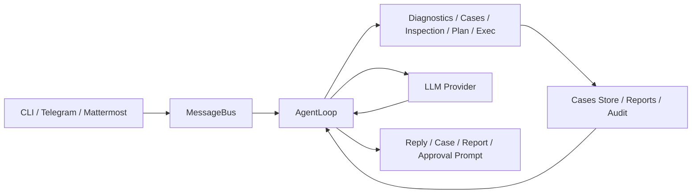

<div align="center">
  
  <h1>HCIGuard</h1>
  <p>HCI troubleshooting assistant built on top of nanobot.</p>
  <p>
    
    
  </p>
</div>

<p align="center">
  English | <a href="README.zh-CN.md">简体中文</a>
</p>

HCIGuard is a focused troubleshooting assistant for HCI environments. It keeps the original nanobot runtime as the base, then adds HCI-oriented diagnostics, case recording, inspection workflows, safety controls, and IM integration for operational use.

## 10-Minute Path

1. Install from source
2. Run `nanobot onboard`
3. Configure one model provider in `~/.nanobot/config.json`
4. Enable diagnostics, cases, and inspection targets
5. Start `nanobot agent` for local debugging or `nanobot gateway` for IM access
6. Run `nanobot inspection run --no-llm --trigger manual`
7. Review generated reports and cases

If you only want the shortest usable path, use the install and quick start sections below, then test with:

```bash
nanobot agent
```

Ask:

```text
检查 /var/log/system.log 最近 200 行是否有 error，并给出结论
```

## What It Does

- Read logs and inspect host state with controlled, read-only diagnostic tools
- Record troubleshooting sessions as searchable cases
- Run inspections, generate reports, and optionally convert findings into cases
- Enforce readonly command execution with manual approvals and audit logging
- Support multiple model providers
- Deliver through CLI, Telegram, and Mattermost

## Current Scope

Current interaction entry points:

- CLI
- Telegram
- Mattermost

Current HCI-oriented capabilities:

- Diagnostics: `diagnose_log_read`, `diagnose_log_search`, `diagnose_system_status`
- Cases: record, import, search, show
- Inspection: log scan, command/journal targets, report output, scheduled execution
- Safety: readonly `exec`, approval file, unified command audit
- Planning: structured troubleshooting plans
- Skills: built-in HCI troubleshooting skills

## Prerequisites

- Python `>= 3.11`
- A reachable model provider endpoint and API key
- Local readonly access to target logs or diagnostic commands
- For Telegram or Mattermost usage: bot token and allowed user configuration
- For inspection on Linux nodes: access to log files, `journalctl`, and selected readonly commands

## Architecture

Main runtime flow:

`CLI / Telegram / Mattermost -> MessageBus -> AgentLoop -> Tools / LLM -> Response`



Core HCI additions in this fork:

- Diagnostics tools: [diagnostics.py](/Users/ruibinhuang/repos/nanobot/nanobot/agent/tools/diagnostics.py)
- Case system: [store.py](/Users/ruibinhuang/repos/nanobot/nanobot/cases/store.py)
- Inspection service: [service.py](/Users/ruibinhuang/repos/nanobot/nanobot/inspection/service.py)
- Command safety and audit: [command_guard.py](/Users/ruibinhuang/repos/nanobot/nanobot/security/command_guard.py), [audit.py](/Users/ruibinhuang/repos/nanobot/nanobot/security/audit.py)
- Mattermost channel: [mattermost.py](/Users/ruibinhuang/repos/nanobot/nanobot/channels/mattermost.py)

## Deployment Modes

Current recommended deployment modes:

- Local debugging:
  run `nanobot agent` on a workstation or admin jump host
- IM service mode:
  run `nanobot gateway` in the background and receive requests from Telegram or Mattermost
- HCI inspection node:
  deploy on a node with controlled readonly access to target logs and system commands

Current implementation is strongest for single-host or single-node diagnostics. Cross-host orchestration is still a next-stage capability, not a finished V1 feature.

## Install

From source:

```bash
git clone https://github.com/BBossss/nanobot.git
cd nanobot
pip install -e .
```

Optional test dependency:

```bash
pip install pytest
```

## Quick Start

Initialize workspace files and default templates:

```bash
nanobot onboard
```

Configure your model in `~/.nanobot/config.json`:

```json
{
  "agents": {
    "defaults": {
      "model": "openai-codex/gpt-5.1-codex-max",
      "provider": "auto"
    }
  },
  "providers": {
    "openrouter": {
      "apiKey": "sk-or-v1-xxx"
    }
  }
}
```

Recommended first-run HCI settings:

```json
{
  "cases": {
    "enabled": true,
    "recordMode": "end_only"
  },
  "inspection": {
    "enabled": true
  },
  "tools": {
    "exec": {
      "readonlyMode": true
    },
    "diagnostics": {
      "enabled": true
    }
  }
}
```

Start local interactive mode:

```bash
nanobot agent
```

Start gateway mode for Telegram or Mattermost:

```bash
nanobot gateway
```

Run in background:

```bash
nohup python3 -m nanobot.cli.commands gateway > tmp/hciguard_gateway.log 2>&1 &
```

## Minimal HCI Configuration

Example:

```json
{
  "cases": {
    "enabled": true,
    "autoRecord": true,
    "recordMode": "end_only",
    "path": "~/.nanobot/workspace/notes/cases"
  },
  "inspection": {
    "enabled": true,
    "reportDir": "~/.nanobot/workspace/reports/inspection",
    "generateCaseOn": "error",
    "targets": [
      {
        "name": "syslog",
        "kind": "log_file",
        "enabled": true,
        "path": "/var/log/system.log",
        "keywords": ["error", "failed", "panic"],
        "maxLines": 500,
        "maxMatches": 50
      }
    ]
  },
  "tools": {
    "exec": {
      "readonlyMode": true,
      "allowedCommands": ["ls", "cat", "grep", "journalctl", "systemctl"],
      "approvalFile": "~/.nanobot/workspace/approvals/exec_allow.json"
    },
    "diagnostics": {
      "enabled": true,
      "timeout": 20,
      "maxReadLines": 2000,
      "maxSearchHits": 100,
      "allowedPaths": ["/var/log", "/opt/logs"]
    }
  }
}
```

A reference file is also available at [hci-minimal-config.json](/Users/ruibinhuang/repos/nanobot/examples/hci-minimal-config.json).

## Typical Workflow

### Local Troubleshooting

1. Start `nanobot agent`
2. Describe the incident with time window, host, service, and symptoms
3. Let HCIGuard inspect logs and current host state with readonly tools
4. Review the conclusion and suggested next step
5. Save the session as a case or let `recordMode=end_only` save the summary automatically

### Inspection and Reporting

1. Define inspection targets in `inspection.targets`
2. Run:

```bash
nanobot inspection run --no-llm --trigger manual
```

3. Review the generated report under `~/.nanobot/workspace/reports/inspection`
4. If configured, abnormal findings are converted into cases automatically

### IM-Based Operation

1. Configure Telegram or Mattermost
2. Start:

```bash
nanobot gateway
```

3. Send troubleshooting requests from the allowed account
4. Review command approvals and audit records if restricted actions are requested

## Channels

### Telegram

```json
{
  "channels": {
    "telegram": {
      "enabled": true,
      "token": "YOUR_BOT_TOKEN",
      "allowFrom": ["YOUR_USER_ID"]
    }
  }
}
```

### Mattermost

```json
{
  "channels": {
    "mattermost": {
      "enabled": true,
      "baseUrl": "https://mm.example.com",
      "token": "YOUR_BOT_TOKEN",
      "allowFrom": ["YOUR_USER_ID"]
    }
  }
}
```

## Common Commands

```bash
nanobot status
nanobot agent
nanobot gateway
nanobot cases list --limit 20
nanobot cases show INC-YYYYMMDD-001
nanobot cases import ./legacy_cases
nanobot inspection run --no-llm --trigger manual
nanobot approvals list
nanobot approvals grant --command "systemctl restart kubelet"
nanobot approvals revoke --command "systemctl restart kubelet"
```

## Files and Outputs

Main runtime paths:

- Config: `~/.nanobot/config.json`
- Workspace: `~/.nanobot/workspace`
- Cases: `~/.nanobot/workspace/notes/cases`
- Reports: `~/.nanobot/workspace/reports/inspection`
- Audit log: `~/.nanobot/workspace/audit/commands.jsonl`
- Sessions: `~/.nanobot/workspace/sessions`

Example case file:

- [sample-storage-timeout.md](/Users/ruibinhuang/repos/nanobot/examples/cases/sample-storage-timeout.md)

## What This Repository Does Not Do

Current non-goals or incomplete areas:

- It is not a generic multi-channel personal assistant anymore
- It does not provide unrestricted shell execution by default
- It does not yet implement full cross-host troubleshooting orchestration
- It does not ship a production web UI in this repository
- It does not replace external CMDB, monitoring, or ticket systems; those are future integration targets

## Example Troubleshooting Prompt

You can start with messages like:

```text
节点 storage-02 从今天 14:00 开始延迟升高，请检查最近 500 行存储相关错误日志，给出证据、初步结论和下一步建议。
```

Expected output style:

- Incident summary
- Key evidence
- Preliminary conclusion
- Recommended next step
- Risk or unknowns that still need confirmation

## Testing

Run the current focused regression set:

```bash
python3 -m pytest -q \
  tests/test_commands.py \
  tests/test_mattermost_channel.py \
  tests/test_case_policy.py \
  tests/test_case_record_mode.py \
  tests/test_cases.py \
  tests/test_inspection_service.py \
  tests/test_exec_readonly_approval.py \
  tests/test_cron_inspection_tool.py \
  tests/test_hci_skills.py
```

Live validation assets:

- [hci-live-validation-checklist-v1.md](/Users/ruibinhuang/repos/nanobot/docs/hci-live-validation-checklist-v1.md)
- [run_hci_acceptance.sh](/Users/ruibinhuang/repos/nanobot/scripts/run_hci_acceptance.sh)

## Documentation

- [HCIGuard feature guide](/Users/ruibinhuang/repos/nanobot/docs/hci-feature-guide-v1.md)
- [Technical design](/Users/ruibinhuang/repos/nanobot/docs/technical-design-hci-troubleshooting-assistant-v1.md)
- [Development status](/Users/ruibinhuang/repos/nanobot/docs/development-status-v1.md)
- [Skill spec](/Users/ruibinhuang/repos/nanobot/docs/skill-spec-v1.md)
- [Repository slimming plan](/Users/ruibinhuang/repos/nanobot/docs/repository-slimming-plan-v1.md)

## Notes

- The package and CLI command remain `nanobot` for now.
- The assistant persona and current product name are `HCIGuard`.
- This repository is no longer positioned as a generic multi-channel personal assistant.
