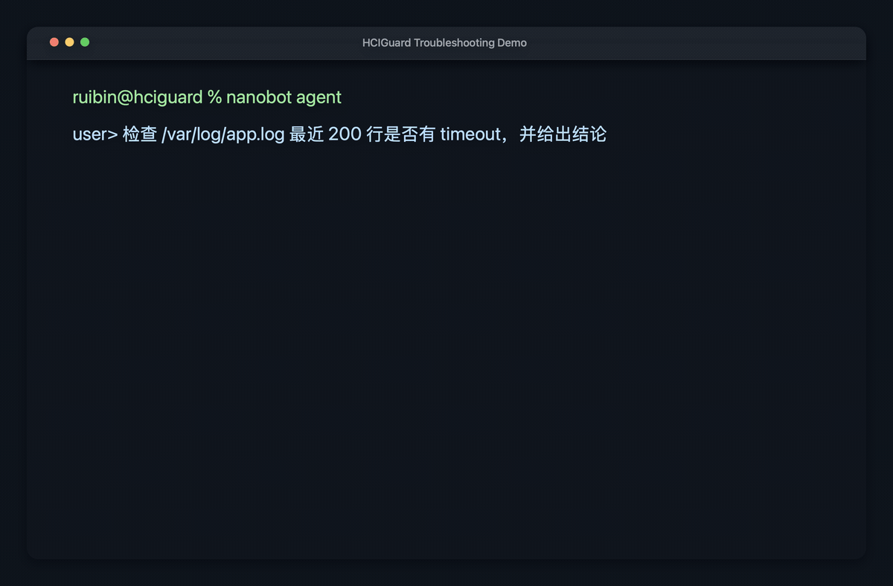
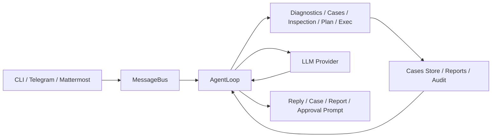

<!--
Set once for your checkout before sharing:
REPO_SLUG=<owner>/<repo>  e.g. BBossss/nanobot or your-fork/org-name
-->

<div align="center">
  
  <h1>HCIGuard</h1>
  <p>Operational HCI troubleshooting assistant, built on nanobot.</p>
  <p>Audit-first. Read-only by default. Investigation-first by design.</p>
  <p>
    
    <a href="https://github.com/${REPO_SLUG}/actions/workflows/ci.yml">
      
    </a>
    <a href="https://codecov.io/gh/${REPO_SLUG}">
      
    </a>
    
    
  </p>
</div>

<p align="center">
  English | <a href="README.zh-CN.md">简体中文</a>
</p>

HCIGuard is a focused troubleshooting assistant for HCI environments. It keeps the original `nanobot` runtime as the base, then adds HCI-oriented diagnostics, case recording, inspection workflows, safety controls, and IM integration for operational use.

What makes HCIGuard different is not chatbot behavior, but an operations-safe troubleshooting control plane: investigate first, execute second, keep every step auditable.

**One-line positioning:** For HCI incidents, HCIGuard keeps work evidence-first, execution-approved, and fully auditable from start to finish.

## HCIGuard vs Generic Agent Runtime

| Dimension | Generic Agent Runtime | HCIGuard |
| --- | --- | --- |
| Primary use | General chat/task automation | HCI triage and on-call troubleshooting |
| Execution model | Tool calls without target context | Target-aware execution (`local` and `user@host[:port]`) |
| Default safety | Depends on prompt and tool policy | Readonly-by-default execution + approval file + command audit |
| Operational loop | One-shot responses | Diagnosis-first sequence + case/inspection artifacts |
| Team ops fit | Usually single conversation | Case store, inspection reports, IM channels |

## 20-Second Positioning Check

- If your pain is "I need a more controlled operations agent", HCIGuard is aligned.
- If your pain is "I need a model to write code and browse the web", this is likely not the right fit.

## 10-Minute Path

1. Install from source
2. Run `nanobot onboard`
3. Configure one model provider in `~/.nanobot/config.json`
4. Enable diagnostics, cases, and inspection targets
5. Start `nanobot agent` for local debugging or `nanobot gateway` for IM access
6. Run `nanobot inspection run --no-llm --trigger manual`
7. Review generated reports and cases

If you only want the shortest usable path, use the install and quick start sections below, then test with:

```bash
nanobot agent
```

Ask:

```text
检查 /var/log/system.log 最近 200 行是否有 error，并给出结论
```

## Troubleshooting Demo

HCIGuard now makes the investigation process visible while it works: it emits stage progress, explains why it is checking a source, shows long-wait heartbeats, and adds a short process summary before the final conclusion.



## End-to-End Troubleshooting Example

Incident flow (typical):

1. Ask HCIGuard:

```text
节点 storage-02 从今天 14:00 到 14:30 出现 I/O 延迟抖动，先给出定位结论。
```

2. HCIGuard actions:

- `find_logs` / `search_log` on system and storage logs
- `service_status` and `process_snapshot` for `kubelet`, `ceph`, and related daemons
- `journal_tail` on recent storage target errors

3. Report artifacts:

- Evidence-backed summary in chat
- New case stored under `~/.nanobot/workspace/notes/cases`
- Optional inspection report under `~/.nanobot/workspace/reports/inspection` when configured

4. Next step:

- If risky action is needed, HCIGuard requests approval before any privileged `exec`
- Audit record written to `~/.nanobot/workspace/audit/commands.jsonl`

## What It Does

- Read logs and inspect host state with controlled, read-only diagnostic tools
- Use target-aware, read-only troubleshooting tools (`find_logs`, `read_log_tail`, `search_log`, `service_status`, `process_snapshot`, `journal_tail`, `disk_snapshot`, `network_snapshot`, `find_recent_files`)
- Show visible troubleshooting progress with stage feedback, investigation reasons, long-wait heartbeats, and a short pre-conclusion summary
- Record troubleshooting sessions as searchable cases
- Run inspections, generate reports, and optionally convert findings into cases
- Enforce readonly command execution with manual approvals and audit logging
- Run `exec` against `target` values such as `local` or `user@host[:port]`
- Support multiple model providers
- Deliver through CLI, Telegram, and Mattermost

## Current Scope

Current interaction entry points:

- CLI
- Telegram
- Mattermost

Current HCI-oriented capabilities:

- Diagnostics: `diagnose_log_read`, `diagnose_log_search`, `diagnose_system_status`
- Troubleshooting: investigation-first flow with read-only tools, strong progress feedback, confirmed multi-target scope expansion, fallback to `exec` when needed
- Cases: record, import, search, show
- Inspection: log scan, command/journal targets, report output, scheduled execution
- Safety: readonly `exec`, `target`-aware SSH execution, approval file, unified command audit
- Planning: structured troubleshooting plans
- Skills: built-in HCI troubleshooting skills

## Prerequisites

- Python `>= 3.11`
- A reachable model provider endpoint and API key
- Local readonly access to target logs or diagnostic commands
- For Telegram or Mattermost usage: bot token and allowed user configuration
- For inspection on Linux nodes: access to log files, `journalctl`, and selected readonly commands

## Architecture

Main runtime flow:

`CLI / Telegram / Mattermost -> MessageBus -> AgentLoop -> Tools / LLM -> Response`



Core HCI additions in this fork:

- Diagnostics tools: [diagnostics.py](nanobot/agent/tools/diagnostics.py)
- Case system: [store.py](nanobot/cases/store.py)
- Inspection service: [service.py](nanobot/inspection/service.py)
- Command safety and audit: [command_guard.py](nanobot/security/command_guard.py), [audit.py](nanobot/security/audit.py)
- Mattermost channel: [mattermost.py](nanobot/channels/mattermost.py)

## Deployment Modes

Current recommended deployment modes:

- Local debugging:
  run `nanobot agent` on a workstation or admin jump host
- IM service mode:
  run `nanobot gateway` in the background and receive requests from Telegram or Mattermost
- HCI inspection node:
  deploy on a node with controlled readonly access to target logs and system commands

Current implementation is strongest for single-host or single-node diagnostics. Confirmed multi-target troubleshooting is available for a bounded set of read-only checks, but broad cross-host orchestration is still an incremental next-stage capability rather than a fully general V1 feature.

## Roadmap

Current baseline (V1):

- Single-host/single-node HCI troubleshooting loop
- Investigation-first workflow with read-only tools
- Controlled execution approvals and unified command audit
- Cases, inspection reports, and IM channel entrypoints

Planned next milestones:

- V1.1: Multi-host inspection targets with host-level tagging and routing
- V1.2: Cross-host correlation for inspection findings and incident timelines
- V1.3: Incident-to-case lifecycle (linking, handoff, and status transitions)
- V1.4: Time-window aware evidence bundling for root-cause review

Not in current scope:

- Automatic remediation execution
- Fully autonomous multi-agent coordination
- Full production-grade web UI

## Install

Recommended local install:

```bash
uv tool install nanobot-ai
```

Alternative source install:

```bash
git clone https://github.com/${REPO_SLUG}.git
cd nanobot
pip install -e .
```

Optional test dependency:

```bash
pip install pytest
```

## Quick Start

First run:

```bash
nanobot
```

If minimal config is missing, HCIGuard automatically starts an onboarding wizard and asks for:

- `base_url`
- `api_key`
- `model`

Default first-run path:

```json
{
  "agents": {
    "defaults": {
      "model": "gpt-4.1-mini",
      "provider": "custom"
    }
  },
  "providers": {
    "custom": {
      "apiBase": "http://gateway.example/v1",
      "apiKey": "sk-xxx"
    }
  }
}
```

After onboarding, verify readiness:

```bash
nanobot doctor
```

Shortest usable path:

```bash
nanobot quickstart
nanobot agent
```

Recommended first-run HCI settings:

```json
{
  "cases": {
    "enabled": true,
    "recordMode": "end_only"
  },
  "inspection": {
    "enabled": true
  },
  "tools": {
    "exec": {
      "readonlyMode": true,
      "defaultTarget": "local",
      "maxInvestigationRounds": 8,
      "ssh": {
        "enabled": true,
        "port": 22
      }
    },
    "diagnostics": {
      "enabled": true
    }
  }
}
```

Start local interactive mode:

```bash
nanobot agent
```

Start gateway mode for Telegram or Mattermost:

```bash
nanobot gateway
```

Run in background:

```bash
nohup python3 -m nanobot.cli.commands gateway > tmp/hciguard_gateway.log 2>&1 &
```

## Minimal HCI Configuration

Example:

```json
{
  "cases": {
    "enabled": true,
    "autoRecord": true,
    "recordMode": "end_only",
    "path": "~/.nanobot/workspace/notes/cases"
  },
  "inspection": {
    "enabled": true,
    "reportDir": "~/.nanobot/workspace/reports/inspection",
    "generateCaseOn": "error",
    "targets": [
      {
        "name": "syslog",
        "kind": "log_file",
        "enabled": true,
        "path": "/var/log/system.log",
        "keywords": ["error", "failed", "panic"],
        "maxLines": 500,
        "maxMatches": 50
      }
    ]
  },
  "tools": {
    "exec": {
      "readonlyMode": true,
      "defaultTarget": "local",
      "allowedCommands": ["ls", "cat", "grep", "journalctl", "systemctl"],
      "approvalFile": "~/.nanobot/workspace/approvals/exec_allow.json",
      "ssh": {
        "enabled": true,
        "port": 22
      }
    },
    "diagnostics": {
      "enabled": true,
      "timeout": 20,
      "maxReadLines": 2000,
      "maxSearchHits": 100,
      "allowedPaths": ["/var/log", "/opt/logs"]
    }
  }
}
```

A reference file is also available at [hci-minimal-config.json](examples/hci-minimal-config.json).

For remote troubleshooting, prefer structured `target` usage through the `exec` tool instead of asking the model to compose raw `ssh ...` command strings. Password-based SSH, when used, stays in process memory only and is not written to session history or audit details.
In interactive CLI mode, if SSH authentication fails and the current target requires a password, HCIGuard can prompt once for the SSH password using hidden terminal input and retry in-process.

For local loopback validation of the SSH path, use:

```bash
python3 scripts/local_ssh_lab.py start
python3 scripts/local_ssh_lab.py status
python3 scripts/local_ssh_lab.py stop
```

This starts two local targets under `/tmp/nanobot-ssh-lab`:
- Pubkey SSH: `<your-user>@127.0.0.1:2322`
- Password SSH: `nanobot@127.0.0.1:2323` with password `secret-123`

You can also run the full loopback acceptance in one shot:

```bash
python3 scripts/run_exec_ssh_loopback_acceptance.py
```

## Typical Workflow

### Local Troubleshooting

1. Start `nanobot agent`
2. Describe the incident with time window, host, service, and symptoms
3. Let HCIGuard inspect logs and current host state with readonly tools
4. Review the conclusion and suggested next step
5. Save the session as a case or let `recordMode=end_only` save the summary automatically

### Inspection and Reporting

1. Define inspection targets in `inspection.targets`
2. Run:

```bash
nanobot inspection run --no-llm --trigger manual
```

3. Review the generated report under `~/.nanobot/workspace/reports/inspection`
4. If configured, abnormal findings are converted into cases automatically

### IM-Based Operation

1. Configure Telegram or Mattermost
2. Start:

```bash
nanobot gateway
```

3. Send troubleshooting requests from the allowed account
4. Review command approvals and audit records if restricted actions are requested

## Channels

### Telegram

```json
{
  "channels": {
    "telegram": {
      "enabled": true,
      "token": "YOUR_BOT_TOKEN",
      "allowFrom": ["YOUR_USER_ID"]
    }
  }
}
```

### Mattermost

```json
{
  "channels": {
    "mattermost": {
      "enabled": true,
      "baseUrl": "https://mm.example.com",
      "token": "YOUR_BOT_TOKEN",
      "allowFrom": ["YOUR_USER_ID"]
    }
  }
}
```

## Common Commands

```bash
nanobot status
nanobot agent
nanobot gateway
nanobot cases list --limit 20
nanobot cases show INC-YYYYMMDD-001
nanobot cases import ./legacy_cases
nanobot inspection run --no-llm --trigger manual
nanobot approvals list
nanobot approvals grant --command "systemctl restart kubelet"
nanobot approvals revoke --command "systemctl restart kubelet"
```

## Files and Outputs

Main runtime paths:

- Config: `~/.nanobot/config.json`
- Workspace: `~/.nanobot/workspace`
- Cases: `~/.nanobot/workspace/notes/cases`
- Reports: `~/.nanobot/workspace/reports/inspection`
- Audit log: `~/.nanobot/workspace/audit/commands.jsonl`
- Sessions: `~/.nanobot/workspace/sessions`

Example case file:

- [sample-storage-timeout.md](examples/cases/sample-storage-timeout.md)

## What This Repository Does Not Do

Current non-goals or incomplete areas:

- It is not a generic multi-channel personal assistant anymore
- It does not provide unrestricted shell execution by default
- It does not yet implement full cross-host troubleshooting orchestration
- It does not ship a production web UI in this repository
- It does not replace external CMDB, monitoring, or ticket systems; those are future integration targets

## Example Troubleshooting Prompt

You can start with messages like:

```text
节点 storage-02 从今天 14:00 开始延迟升高，请检查最近 500 行存储相关错误日志，给出证据、初步结论和下一步建议。
```

Expected output style:

- Incident summary
- Key evidence
- Preliminary conclusion
- Recommended next step
- Risk or unknowns that still need confirmation

## Testing

### Quality Signals

- CI: GitHub Actions workflow with lint + focused regression checks (badge above).
- Coverage: `python3 -m pytest --cov=nanobot --cov-report=xml tests` in CI, artifact at `coverage.xml`.
- Focused tests list below is used by both local validation and CI.
- If this repository is private, configure `CODECOV_TOKEN` in GitHub secrets to make the coverage badge fully functional.

Run the current focused regression set:

```bash
python3 -m pytest -q \
  tests/test_commands.py \
  tests/test_mattermost_channel.py \
  tests/test_case_policy.py \
  tests/test_case_record_mode.py \
  tests/test_cases.py \
  tests/test_inspection_service.py \
  tests/test_exec_readonly_approval.py \
  tests/test_cron_inspection_tool.py \
  tests/test_hci_skills.py
```

Live validation assets:

- [hci-live-validation-checklist-v1.md](docs/hci-live-validation-checklist-v1.md)
- [run_hci_acceptance.sh](scripts/run_hci_acceptance.sh)
- [local_ssh_lab.py](scripts/local_ssh_lab.py)
- [run_exec_ssh_loopback_acceptance.py](scripts/run_exec_ssh_loopback_acceptance.py)

## Documentation

- [HCIGuard feature guide](docs/hci-feature-guide-v1.md)
- [V1.x roadmap](docs/roadmap-v1.x.md)
- [Technical design](docs/technical-design-hci-troubleshooting-assistant-v1.md)
- [Development status](docs/development-status-v1.md)
- [Skill spec](docs/skill-spec-v1.md)
- [Repository slimming plan](docs/repository-slimming-plan-v1.md)

## Notes

- The package and CLI command remain `nanobot` for now.
- The assistant persona and current product name are `HCIGuard`.
- This repository is no longer positioned as a generic multi-channel personal assistant.
