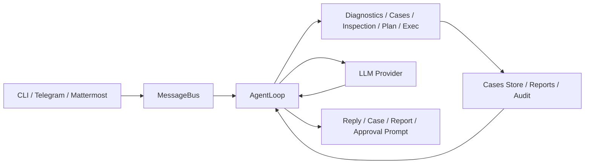

<div align="center">
  
  <h1>HCIGuard</h1>
</div>

[English](README.md) | 简体中文

HCIGuard 是一个面向 HCI 场景的排障助手。它以原始 `nanobot` 运行时为底座，在此基础上增加了 HCI 定向的诊断、案例沉淀、巡检报告、安全控制和 IM 接入能力，用于更贴近现场运维的排障流程。

## 10 分钟上手路径

1. 从源码安装
2. 执行 `nanobot onboard`
3. 在 `~/.nanobot/config.json` 中配置一个模型提供商
4. 打开 diagnostics、cases 和 inspection
5. 本地调试用 `nanobot agent`，IM 接入用 `nanobot gateway`
6. 执行 `nanobot inspection run --no-llm --trigger manual`
7. 查看生成的报告和案例

如果你只想走最短可用路径，可以先执行：

```bash
nanobot agent
```

然后直接提问：

```text
检查 /var/log/system.log 最近 200 行是否有 error，并给出结论
```

## 能做什么

- 使用受控、只读的诊断工具读取日志和检查主机状态
- 将排障过程沉淀为可检索案例
- 执行巡检、生成报告，并在满足条件时自动转案例
- 用只读执行、人工放通和统一审计控制风险
- 支持多模型提供商
- 通过 CLI、Telegram、Mattermost 提供交互入口

## 当前范围

当前保留的交互入口：

- CLI
- Telegram
- Mattermost

当前面向 HCI 的核心能力：

- 诊断：`diagnose_log_read`、`diagnose_log_search`、`diagnose_system_status`
- 案例：记录、导入、检索、查看
- 巡检：日志扫描、`command/journal` 目标、报告输出、定时执行
- 安全：只读 `exec`、审批文件、统一命令审计
- 规划：结构化排障计划
- Skill：内置 HCI 排障 Skill

## 前置条件

- Python `>= 3.11`
- 可访问的模型服务和 API Key
- 对目标日志和只读诊断命令具备本地访问权限
- 如果要接 Telegram 或 Mattermost，需要准备 bot token 和允许用户配置
- 如果要在 Linux 节点上跑巡检，需要能访问日志文件、`journalctl` 和必要的只读命令

## 架构

主链路：

`CLI / Telegram / Mattermost -> MessageBus -> AgentLoop -> Tools / LLM -> Response`



这个分支里与 HCI 直接相关的核心模块：

- 诊断工具：[diagnostics.py](nanobot/agent/tools/diagnostics.py)
- 案例系统：[store.py](nanobot/cases/store.py)
- 巡检服务：[service.py](nanobot/inspection/service.py)
- 命令安全与审计：[command_guard.py](nanobot/security/command_guard.py)、[audit.py](nanobot/security/audit.py)
- Mattermost 渠道：[mattermost.py](nanobot/channels/mattermost.py)

## 部署形态

当前推荐 3 种部署方式：

- 本地调试：
  在工作站或运维跳板机上运行 `nanobot agent`
- IM 服务模式：
  后台运行 `nanobot gateway`，通过 Telegram 或 Mattermost 收发消息
- HCI 巡检节点：
  部署在具备受控只读权限的节点上，直接读取目标日志并执行受限诊断命令

当前实现最适合单机或单节点诊断。跨主机统一编排还属于下一阶段能力，不是当前 V1 的完成项。

## 安装

从源码安装：

```bash
git clone https://github.com/BBossss/nanobot.git
cd nanobot
pip install -e .
```

如果你要本地跑测试：

```bash
pip install pytest
```

## 快速开始

初始化工作区和默认模板：

```bash
nanobot onboard
```

在 `~/.nanobot/config.json` 中配置模型：

```json
{
  "agents": {
    "defaults": {
      "model": "openai-codex/gpt-5.1-codex-max",
      "provider": "auto"
    }
  },
  "providers": {
    "openrouter": {
      "apiKey": "sk-or-v1-xxx"
    }
  }
}
```

推荐首跑配置：

```json
{
  "cases": {
    "enabled": true,
    "recordMode": "end_only"
  },
  "inspection": {
    "enabled": true
  },
  "tools": {
    "exec": {
      "readonlyMode": true
    },
    "diagnostics": {
      "enabled": true
    }
  }
}
```

启动本地交互：

```bash
nanobot agent
```

启动网关模式：

```bash
nanobot gateway
```

后台运行：

```bash
nohup python3 -m nanobot.cli.commands gateway > tmp/hciguard_gateway.log 2>&1 &
```

## 最小 HCI 配置示例

```json
{
  "cases": {
    "enabled": true,
    "autoRecord": true,
    "recordMode": "end_only",
    "path": "~/.nanobot/workspace/notes/cases"
  },
  "inspection": {
    "enabled": true,
    "reportDir": "~/.nanobot/workspace/reports/inspection",
    "generateCaseOn": "error",
    "targets": [
      {
        "name": "syslog",
        "kind": "log_file",
        "enabled": true,
        "path": "/var/log/system.log",
        "keywords": ["error", "failed", "panic"],
        "maxLines": 500,
        "maxMatches": 50
      }
    ]
  },
  "tools": {
    "exec": {
      "readonlyMode": true,
      "allowedCommands": ["ls", "cat", "grep", "journalctl", "systemctl"],
      "approvalFile": "~/.nanobot/workspace/approvals/exec_allow.json"
    },
    "diagnostics": {
      "enabled": true,
      "timeout": 20,
      "maxReadLines": 2000,
      "maxSearchHits": 100,
      "allowedPaths": ["/var/log", "/opt/logs"]
    }
  }
}
```

参考文件：

- [hci-minimal-config.json](examples/hci-minimal-config.json)

## 典型使用流程

### 本地排障

1. 启动 `nanobot agent`
2. 告诉 HCIGuard 故障时间窗口、涉及主机、服务和现象
3. 让它用只读工具检查日志和主机状态
4. 查看结论和建议动作
5. 手动保存案例，或让 `recordMode=end_only` 在总结阶段自动落盘

### 巡检和报告

1. 在 `inspection.targets` 中配置巡检目标
2. 执行：

```bash
nanobot inspection run --no-llm --trigger manual
```

3. 在 `~/.nanobot/workspace/reports/inspection` 下查看报告
4. 如果已配置，异常结果会自动转成案例

### IM 方式使用

1. 配置 Telegram 或 Mattermost
2. 启动：

```bash
nanobot gateway
```

3. 从允许的账号发送排障请求
4. 如遇受限动作，查看审批记录和审计日志

## 渠道配置

### Telegram

```json
{
  "channels": {
    "telegram": {
      "enabled": true,
      "token": "YOUR_BOT_TOKEN",
      "allowFrom": ["YOUR_USER_ID"]
    }
  }
}
```

### Mattermost

```json
{
  "channels": {
    "mattermost": {
      "enabled": true,
      "baseUrl": "https://mm.example.com",
      "token": "YOUR_BOT_TOKEN",
      "allowFrom": ["YOUR_USER_ID"]
    }
  }
}
```

## 常用命令

```bash
nanobot status
nanobot agent
nanobot gateway
nanobot cases list --limit 20
nanobot cases show INC-YYYYMMDD-001
nanobot cases import ./legacy_cases
nanobot inspection run --no-llm --trigger manual
nanobot approvals list
nanobot approvals grant --command "systemctl restart kubelet"
nanobot approvals revoke --command "systemctl restart kubelet"
```

## 主要输出路径

- 配置文件：`~/.nanobot/config.json`
- 工作区：`~/.nanobot/workspace`
- 案例目录：`~/.nanobot/workspace/notes/cases`
- 巡检报告：`~/.nanobot/workspace/reports/inspection`
- 审计日志：`~/.nanobot/workspace/audit/commands.jsonl`
- 会话记录：`~/.nanobot/workspace/sessions`

示例案例：

- [sample-storage-timeout.md](examples/cases/sample-storage-timeout.md)

## 当前不做什么

- 不再把仓库定位成通用多渠道个人助理
- 默认不开放无限制 shell 执行
- 还没有完成跨主机统一排障编排
- 当前仓库里没有正式的生产级 Web UI
- 不替代外部 CMDB、监控系统、工单系统，这些属于后续集成目标

## 示例排障提问

你可以这样发起请求：

```text
节点 storage-02 从今天 14:00 开始延迟升高，请检查最近 500 行存储相关错误日志，给出证据、初步结论和下一步建议。
```

预期输出结构：

- 故障摘要
- 关键证据
- 初步结论
- 下一步建议
- 仍需确认的风险或未知项

## 测试

当前聚焦回归集：

```bash
python3 -m pytest -q \
  tests/test_commands.py \
  tests/test_mattermost_channel.py \
  tests/test_case_policy.py \
  tests/test_case_record_mode.py \
  tests/test_cases.py \
  tests/test_inspection_service.py \
  tests/test_exec_readonly_approval.py \
  tests/test_cron_inspection_tool.py \
  tests/test_hci_skills.py
```

联调与验收资料：

- [hci-live-validation-checklist-v1.md](docs/hci-live-validation-checklist-v1.md)
- [run_hci_acceptance.sh](scripts/run_hci_acceptance.sh)

## 相关文档

- [HCIGuard 功能文档](docs/hci-feature-guide-v1.md)
- [技术设计](docs/technical-design-hci-troubleshooting-assistant-v1.md)
- [开发状态](docs/development-status-v1.md)
- [Skill 规范](docs/skill-spec-v1.md)
- [仓库瘦身方案](docs/repository-slimming-plan-v1.md)

## 说明

- 当前包名和 CLI 命令仍然保留 `nanobot`
- 当前对外产品名和助手身份是 `HCIGuard`
- 这个仓库已经不再按“通用多渠道个人助理”来维护
