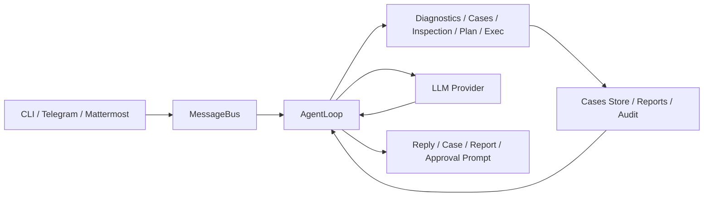

<!--
在外发或 fork 后，请一次性设置仓库变量：
REPO_SLUG=<组织>/<仓库名>，例如 BBossss/nanobot 或你的实际仓库
-->

<div align="center">
  
  <h1>HCIGuard</h1>
  <p>面向 HCI 的现场排障助手（基于 nanobot）。</p>
  <p>默认只读、可审计、先调查后执行。</p>
</div>

[English](README.md) | 简体中文
<p align="center">
  <a href="https://github.com/${REPO_SLUG}/actions/workflows/ci.yml">
    
  </a>
  <a href="https://codecov.io/gh/${REPO_SLUG}">
    
  </a>
  
  
</p>

HCIGuard 是一个面向 HCI 场景的排障助手。它以原始 `nanobot` 运行时为底座，在此基础上增加了 HCI 定向的诊断、案例沉淀、巡检报告、安全控制和 IM 接入能力，形成更贴近现场运维的排障流程。

它的核心不是“更会聊天”，而是把排障工作流固化为可控的安全闭环：先调查、后执行、全链路可审计。

**一句话定位：** HCIGuard 将 HCI 故障处理落在“先证据、后执行、全过程可追溯”闭环里。

## HCIGuard 与通用 Agent 的差异

| 对比维度 | 通用 Agent | HCIGuard |
| --- | --- | --- |
| 目标场景 | 通用聊天/任务自动化 | HCI 故障排障与现场响应 |
| 执行方式 | 工具调用缺少主机上下文 | 目标感知执行（`local` / `user@host[:port]`） |
| 安全边界 | 依赖提示词与单点策略 | 默认只读执行 + 审批文件 + 命令审计 |
| 排障流程 | 单点问答为主 | 调查优先链路 + 案例与巡检痕迹 |
| 团队协作 | 通常偏交互式单会话 | 案例库、巡检报告、IM 通道 |

## 20 秒确认是否适配

- 如果你的核心问题是“需要可控、可复盘的现场排障助手”，HCIGuard 更匹配。
- 如果你要的是“写代码/通用文本 AI”，它不是主要目标。

## 10 分钟上手路径

1. 从源码安装
2. 执行 `nanobot onboard`
3. 在 `~/.nanobot/config.json` 中配置一个模型提供商
4. 打开 diagnostics、cases 和 inspection
5. 本地调试用 `nanobot agent`，IM 接入用 `nanobot gateway`
6. 执行 `nanobot inspection run --no-llm --trigger manual`
7. 查看生成的报告和案例

如果你只想走最短可用路径，可以先执行：

```bash
nanobot agent
```

然后直接提问：

```text
检查 /var/log/system.log 最近 200 行是否有 error，并给出结论
```

## 端到端排障示例

典型处理闭环如下：

1. 发起排障请求：

```text
节点 storage-02 从今天 14:00 到 14:30 出现 I/O 延迟抖动，先给出定位结论。
```

2. HCIGuard 自动执行排障动作：

- `find_logs` / `search_log` 读取存储与系统日志
- `service_status`、`process_snapshot` 检查 kubelet、ceph 等关键服务
- `journal_tail` 拉取最近故障相关事件

3. 输出可复盘证据：

- 对话中返回“关键证据 + 初步结论 + 下一步建议”
- 自动落盘案例到 `~/.nanobot/workspace/notes/cases`
- 若配置了巡检，异常会生成报告至 `~/.nanobot/workspace/reports/inspection`

4. 执行动作确认：

- 若需要高风险操作，HCIGuard 会先发起审批
- 操作请求与执行结果持续写入 `~/.nanobot/workspace/audit/commands.jsonl`

## 能做什么

- 使用受控、只读的诊断工具读取日志和检查主机状态
- 提供高频只读排障调查动作：`find_logs`、`read_log_tail`、`search_log`、`service_status`、`process_snapshot`、`journal_tail`、`disk_snapshot`、`network_snapshot`、`find_recent_files`
- 将排障过程沉淀为可检索案例
- 执行巡检、生成报告，并在满足条件时自动转案例
- 用只读执行、人工放通和统一审计控制风险
- 支持多模型提供商
- 通过 CLI、Telegram、Mattermost 提供交互入口

## 当前范围

当前保留的交互入口：

- CLI
- Telegram
- Mattermost

当前面向 HCI 的核心能力：

- 诊断：`diagnose_log_read`、`diagnose_log_search`、`diagnose_system_status`
- 排障：优先调查动作，必要时回退 `exec`
- 案例：记录、导入、检索、查看
- 巡检：日志扫描、`command/journal` 目标、报告输出、定时执行
- 安全：只读 `exec`、审批文件、统一命令审计
- 规划：结构化排障计划
- Skill：内置 HCI 排障 Skill

## 前置条件

- Python `>= 3.11`
- 可访问的模型服务和 API Key
- 对目标日志和只读诊断命令具备本地访问权限
- 如果要接 Telegram 或 Mattermost，需要准备 bot token 和允许用户配置
- 如果要在 Linux 节点上跑巡检，需要能访问日志文件、`journalctl` 和必要的只读命令

## 架构

主链路：

`CLI / Telegram / Mattermost -> MessageBus -> AgentLoop -> Tools / LLM -> Response`



这个分支里与 HCI 直接相关的核心模块：

- 诊断工具：[diagnostics.py](nanobot/agent/tools/diagnostics.py)
- 案例系统：[store.py](nanobot/cases/store.py)
- 巡检服务：[service.py](nanobot/inspection/service.py)
- 命令安全与审计：[command_guard.py](nanobot/security/command_guard.py)、[audit.py](nanobot/security/audit.py)
- Mattermost 渠道：[mattermost.py](nanobot/channels/mattermost.py)

## 部署形态

当前推荐 3 种部署方式：

- 本地调试：
  在工作站或运维跳板机上运行 `nanobot agent`
- IM 服务模式：
  后台运行 `nanobot gateway`，通过 Telegram 或 Mattermost 收发消息
- HCI 巡检节点：
  部署在具备受控只读权限的节点上，直接读取目标日志并执行受限诊断命令

当前实现最适合单机或单节点诊断。跨主机统一编排还属于下一阶段能力，不是当前 V1 的完成项。

## Roadmap

当前基线（V1）能力：

- 单机 / 单节点的 HCI 排障闭环
- 调查优先的诊断流程
- 受控执行审批与统一命令审计
- Cases、巡检报告、IM 通道接入

后续里程碑：

- V1.1：支持多主机巡检目标，补齐主机级标记与路由
- V1.2：实现跨主机巡检结果与事件时间线关联
- V1.3：形成 case 生命周期（关联、交接、状态流转）
- V1.4：支持基于时间窗的证据打包，支持复盘

当前不在范围：

- 自动化修复执行
- 完整多 Agent 自动编排
- 正式生产级 Web UI

## 安装

推荐本地安装方式：

```bash
uv tool install nanobot-ai
```

可选源码安装方式：

```bash
git clone https://github.com/${REPO_SLUG}.git
cd nanobot
pip install -e .
```

如果你要本地跑测试：

```bash
pip install pytest
```

## 快速开始

首次运行：

```bash
nanobot
```

如果最小配置缺失，HCIGuard 会自动进入首启向导，并询问：

- `base_url`
- `api_key`
- `model`

默认首跑配置路径：

```json
{
  "agents": {
    "defaults": {
      "model": "gpt-4.1-mini",
      "provider": "custom"
    }
  },
  "providers": {
    "custom": {
      "apiBase": "http://gateway.example/v1",
      "apiKey": "sk-xxx"
    }
  }
}
```

向导结束后，先执行：

```bash
nanobot doctor
```

最短可用路径：

```bash
nanobot quickstart
nanobot agent
```

推荐首跑配置：

```json
{
  "cases": {
    "enabled": true,
    "recordMode": "end_only"
  },
  "inspection": {
    "enabled": true
  },
  "tools": {
    "exec": {
      "readonlyMode": true
    },
    "diagnostics": {
      "enabled": true
    }
  }
}
```

启动本地交互：

```bash
nanobot agent
```

启动网关模式：

```bash
nanobot gateway
```

后台运行：

```bash
nohup python3 -m nanobot.cli.commands gateway > tmp/hciguard_gateway.log 2>&1 &
```

## 最小 HCI 配置示例

```json
{
  "cases": {
    "enabled": true,
    "autoRecord": true,
    "recordMode": "end_only",
    "path": "~/.nanobot/workspace/notes/cases"
  },
  "inspection": {
    "enabled": true,
    "reportDir": "~/.nanobot/workspace/reports/inspection",
    "generateCaseOn": "error",
    "targets": [
      {
        "name": "syslog",
        "kind": "log_file",
        "enabled": true,
        "path": "/var/log/system.log",
        "keywords": ["error", "failed", "panic"],
        "maxLines": 500,
        "maxMatches": 50
      }
    ]
  },
  "tools": {
    "exec": {
      "readonlyMode": true,
      "allowedCommands": ["ls", "cat", "grep", "journalctl", "systemctl"],
      "approvalFile": "~/.nanobot/workspace/approvals/exec_allow.json"
    },
    "diagnostics": {
      "enabled": true,
      "timeout": 20,
      "maxReadLines": 2000,
      "maxSearchHits": 100,
      "allowedPaths": ["/var/log", "/opt/logs"]
    }
  }
}
```

参考文件：

- [hci-minimal-config.json](examples/hci-minimal-config.json)

如果你要在本机回环验证 SSH 路径，可以执行：

```bash
python3 scripts/local_ssh_lab.py start
python3 scripts/local_ssh_lab.py status
python3 scripts/local_ssh_lab.py stop
```

这个脚本会在 `/tmp/nanobot-ssh-lab` 下启动两个本机目标：
- 公钥 SSH：`<你的用户名>@127.0.0.1:2322`
- 密码 SSH：`nanobot@127.0.0.1:2323`，密码是 `secret-123`

如果你要一键跑完整回环验收，可以执行：

```bash
python3 scripts/run_exec_ssh_loopback_acceptance.py
```

## 典型使用流程

### 本地排障

1. 启动 `nanobot agent`
2. 告诉 HCIGuard 故障时间窗口、涉及主机、服务和现象
3. 让它用只读工具检查日志和主机状态
4. 查看结论和建议动作
5. 手动保存案例，或让 `recordMode=end_only` 在总结阶段自动落盘

### 巡检和报告

1. 在 `inspection.targets` 中配置巡检目标
2. 执行：

```bash
nanobot inspection run --no-llm --trigger manual
```

3. 在 `~/.nanobot/workspace/reports/inspection` 下查看报告
4. 如果已配置，异常结果会自动转成案例

### IM 方式使用

1. 配置 Telegram 或 Mattermost
2. 启动：

```bash
nanobot gateway
```

3. 从允许的账号发送排障请求
4. 如遇受限动作，查看审批记录和审计日志

## 渠道配置

### Telegram

```json
{
  "channels": {
    "telegram": {
      "enabled": true,
      "token": "YOUR_BOT_TOKEN",
      "allowFrom": ["YOUR_USER_ID"]
    }
  }
}
```

### Mattermost

```json
{
  "channels": {
    "mattermost": {
      "enabled": true,
      "baseUrl": "https://mm.example.com",
      "token": "YOUR_BOT_TOKEN",
      "allowFrom": ["YOUR_USER_ID"]
    }
  }
}
```

## 常用命令

```bash
nanobot status
nanobot agent
nanobot gateway
nanobot cases list --limit 20
nanobot cases show INC-YYYYMMDD-001
nanobot cases import ./legacy_cases
nanobot inspection run --no-llm --trigger manual
nanobot approvals list
nanobot approvals grant --command "systemctl restart kubelet"
nanobot approvals revoke --command "systemctl restart kubelet"
```

## 主要输出路径

- 配置文件：`~/.nanobot/config.json`
- 工作区：`~/.nanobot/workspace`
- 案例目录：`~/.nanobot/workspace/notes/cases`
- 巡检报告：`~/.nanobot/workspace/reports/inspection`
- 审计日志：`~/.nanobot/workspace/audit/commands.jsonl`
- 会话记录：`~/.nanobot/workspace/sessions`

示例案例：

- [sample-storage-timeout.md](examples/cases/sample-storage-timeout.md)

## 当前不做什么

- 不再把仓库定位成通用多渠道个人助理
- 默认不开放无限制 shell 执行
- 还没有完成跨主机统一排障编排
- 当前仓库里没有正式的生产级 Web UI
- 不替代外部 CMDB、监控系统、工单系统，这些属于后续集成目标

## 示例排障提问

你可以这样发起请求：

```text
节点 storage-02 从今天 14:00 开始延迟升高，请检查最近 500 行存储相关错误日志，给出证据、初步结论和下一步建议。
```

预期输出结构：

- 故障摘要
- 关键证据
- 初步结论
- 下一步建议
- 仍需确认的风险或未知项

## 测试

### 质量信号

- CI：GitHub Actions 工作流覆盖 lint 与关键回归集（上方 badge）。
- 覆盖率：CI 中执行 `python3 -m pytest --cov=nanobot --cov-report=xml tests`，产物为 `coverage.xml`。
- 下方的聚焦回归集为本地与 CI 共用测试集合。
- 私有仓库场景下如需保证 coverage badge 完整可见，请在 GitHub Secrets 配置 `CODECOV_TOKEN`。

当前聚焦回归集：

```bash
python3 -m pytest -q \
  tests/test_commands.py \
  tests/test_mattermost_channel.py \
  tests/test_case_policy.py \
  tests/test_case_record_mode.py \
  tests/test_cases.py \
  tests/test_inspection_service.py \
  tests/test_exec_readonly_approval.py \
  tests/test_cron_inspection_tool.py \
  tests/test_hci_skills.py
```

联调与验收资料：

- [hci-live-validation-checklist-v1.md](docs/hci-live-validation-checklist-v1.md)
- [run_hci_acceptance.sh](scripts/run_hci_acceptance.sh)
- [local_ssh_lab.py](scripts/local_ssh_lab.py)
- [run_exec_ssh_loopback_acceptance.py](scripts/run_exec_ssh_loopback_acceptance.py)

## 相关文档

- [HCIGuard 功能文档](docs/hci-feature-guide-v1.md)
- [V1.x 路线图](docs/roadmap-v1.x.md)
- [技术设计](docs/technical-design-hci-troubleshooting-assistant-v1.md)
- [开发状态](docs/development-status-v1.md)
- [Skill 规范](docs/skill-spec-v1.md)
- [仓库瘦身方案](docs/repository-slimming-plan-v1.md)

## 说明

- 当前包名和 CLI 命令仍然保留 `nanobot`
- 当前对外产品名和助手身份是 `HCIGuard`
- 这个仓库已经不再按“通用多渠道个人助理”来维护
